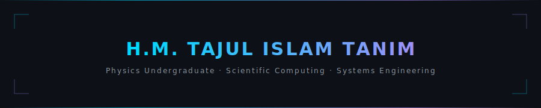

<div align="center">



<br/>

[](https://github.com/tajultonim)
[](https://github.com/tajultonim)
[](https://github.com/tajultonim)

</div>

<br/>


<br/>

I'm a physics undergraduate from Bangladesh building software at the intersection of **science, systems, and scale**. I like working where problems are hard and the math is real — distributed systems, real-time infrastructure, computational science.

Physics shaped how I think about problems. Engineering shapes what I build. I try to do both seriously.

<br/>


## Technologies

**Languages**


**Frameworks & Tools**


<br/>


## Projects

### 💬 SneakyChat

Real-time anonymous chat platform with moderation and reporting infrastructure.


`Node.js` `Socket.IO` `TypeScript` `Azure` `SQL`

- Real-time bidirectional messaging via WebSockets
- Anonymous identity with session management
- Message reporting and moderation pipeline
- Cloud-deployed on Azure

[](https://github.com/tajultonim)

<br/>


## Currently building

| | Project | Status |
|---|---|---|
| `01` | Real-time chat infrastructure | 🟢 Building |
| `02` | WebRTC peer-to-peer image transfer | 🟡 Active |
| `03` | Distributed systems experiments in Node.js | 🔵 Researching |
| `04` | Scalable backend architecture patterns | 🟡 Designing |

<br/>


## Interests

```
Systems & Infrastructure          Scientific Computing
─────────────────────────         ─────────────────────────
Distributed consensus             Computational physics
Event-driven architecture         Numerical methods & solvers
WebRTC & P2P networking           High performance computing
Real-time pub/sub                 Scientific software engineering
Low-latency pipelines             Physics-informed algorithms
```

<br/>


## GitHub stats

<div align="center">


</div>

<div align="center">


</div>

<div align="center">


</div>

<br/>


## Roadmap

```yaml
now:
  - Ship WebRTC P2P file transfer
  - Go deeper on distributed systems theory

next:
  - Graduate research in scientific computing
  - Work on high-performance production systems

eventually:
  - Build something that bridges physics and computation at research scale
```

<br/>


## Connect

[](https://github.com/tajultonim)
[](https://instagram.com/tajultonim)
[](https://facebook.com/tajultonim)

Open to research collaborations, open source, and interesting engineering problems.

<br/>


<div align="center">
<sub>Bangladesh 🇧🇩 &nbsp;·&nbsp; Physics × Engineering &nbsp;·&nbsp; Building systems that move data fast</sub>
</div>
